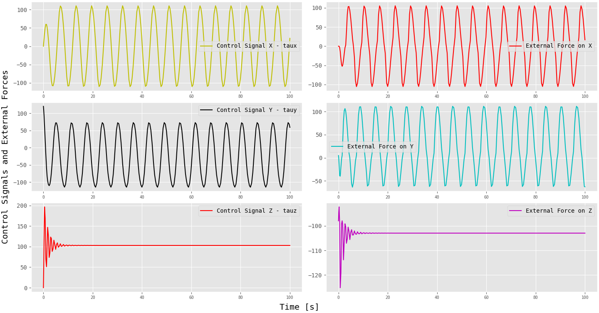

# Simulation of a Dynamic Flying Object

* **Author:** [Turhan Can Kargın](https://github.com/turhancan97)
* **Topic:** Control of Flying Robots Laboratory Assignments

The repository was prepared for the **control of flying robots** lecture, which is one of the Poznan University of Technology Automatic Control and Robotics graduate courses. In this project, the aim is to simulate the control of flying robots in a dynamic environments.

---

Verifying a control algorithm for a flying robot is not a straightforward task. One option is to implement the algorithm on a real-life object, but this can be challenging due to the complex nature of the environment and the limitations of modeling the behavior of the object. Factors such as wind, rain, temperature, and pressure can significantly impact the behavior of the flying robot. Even the model of the robot itself may have important flaws, particularly due to the characteristics of the actuation systems, such as the forces generated by propellers or ailerons, which are dependent on many factors that may make the model impractical.

Numerical simulations, particularly those using computational fluid dynamics methods, can be useful at the initial stage of verification. However, it is important to be aware of the limitations of these simulations.

---

## How to simulate
1. git clone `https://github.com/turhancan97/Flying_Robot_Control.git`
1. Run `cd Flying_Robot_Control/<Simulation Folder Name>` on the terminal
1. Run `python test.py` on the terminal

## Results
### Simple Control Simulation

To simulate a dynamic object, such as an airplane flying at a fixed altitude, we can analyze its behavior in a plane, referred to as the XY-plane. The object, which can be approximated as a rigid body, is fully actuated and can generate propulsion forces along the X and Y axes of its local frame, as well as a torque that changes its orientation, represented by the angle of rotation between the global frame and the frame attached to the object.

In addition to these factors, we must also consider the effect of drag force on the object, which is proportional to its velocity squared and acts equally in all directions.

In summary, to simulate this dynamic object, we are making the following assumptions:

1. The object moves only in the XY-plane.
2. It has three degrees of freedom (3DOF), including movement in the X and Y directions and rotation about an axis perpendicular to the XY-plane.
3. It can be approximated as a rigid body.

The figure below show the flying object on the global and local frame.

</a>

The code (test.py) appears to be a Python script for simulating the dynamics of an object, such as an airplane, and implementing a controller to track a desired trajectory.

The script begins by importing several libraries, including `numpy` for matrix operations, `scipy.integrate.solve_ivp` for solving differential equations, `matplotlib.pyplot` for plotting results, and `animation` for creating animations.

The script defines several functions, including `centrifugal_and_coriolis_forces`, which calculates the centrifugal and Coriolis forces on the object as a 3x3 matrix, and `damping_forces`, which calculates the damping forces on the object as a 1-dimensional array with 3 elements. The `Rba` function calculates the rotation matrix from frame b to frame a, and the trajectory function generates the desired trajectory at a given time t.

The controller function calculates the control inputs for the given state and desired trajectory, using the provided `K_p` gain. The dynamics function describes the dynamics of the object and calculates its acceleration as a function of its state and control inputs.

Finally, the script defines several variables, such as the `mass` and `damping coefficients` of the object, and calls the `solve_ivp` function to solve the differential equation representing the object's dynamics. The resulting trajectory is then plotted and animated.

The figures and animation below are generated for the flying object that has xd = 0, yd = 0, ttad = 0, ud = 1, vd = 0, rd = 0 desired trajectory to track and the object's state starts from xd = 1, yd = 1, ttad = 1, ud = 1, vd = 1, rd = 1.

</a>
<em>Obtained Measurement by Time </em>

</a>
<em>Obtained Trajectories</em>

</a>
<em>Animation</em>

The `controller` function is responsible for calculating the control inputs for the object based on its current state and the desired trajectory. The control inputs are used to drive the object towards the desired trajectory.

The controller function takes three arguments:

- **xi:** A 6x1 array representing the current state of the object, including its position and velocity.
trajectory: A function that generates the desired trajectory at a given time t.
- **K_p:** A gain that determines how aggressively the control inputs should be applied to the object.

The controller function first calls the trajectory function to get the desired state at the current time. It then calculates the error between the current state and the desired state and scales it using the K_p gain. The resulting control inputs are then returned as a 1-dimensional array with 3 elements.

The trajectory function is responsible for generating the desired trajectory at a given time t. The desired trajectory represents the path that the object is intended to follow, and it is used as a reference for the controller to guide the object towards.

The trajectory function takes a single argument:

* t: A float representing the current time in seconds.
The trajectory function then defines the desired state at the current time, including the desired position and velocity of the object. This desired state is represented as a 6x1 array and returned by the function.

### 3D Fyling Robot Control Simulation
A more realistic approach is applied in this simulation. The robot flying in three dimensions. The core of the simulation are the the differentiable equations of motion.

**controller function:** The controller function takes in three arguments: t, xi, and xid. t is the time at which the controller is being applied, xi is a state vector containing information about the current state of the robot, and xid is a reference state vector containing desired values for the robot to achieve.

The function begins by defining a number of variables based on the values in the state vectors xi and xid. x, y, z, R11, R12, R13, R21, R22, R23, R31, R32, R33, u, v, w, p, q, and r are extracted from xi, and xd, yd, zd, R11d, R12d, R13d, R21d, R22d, R23d, R31d, R32d, R33d, ud, vd, wd, pd, qd, and rd are extracted from xid. These variables represent various aspects of the state of the robot, such as its position, orientation, and linear and angular velocities.

The function then defines a number of additional variables based on these state variables. pba is the position of the robot, Rba is the orientation of the robot, gamma is the linear and angular velocities of the robot, vaa is the linear velocity of the robot, and omaa is the angular velocity of the robot. The variables iex, iey, iez, ieR11, ieR12, ieR13, ieR21, ieR22, ieR23, ieR31, ieR32, ieR33, ieu, iev, iew, iep, ieq, and ier are also extracted from xi, and represent errors in the state variables.

The function then defines the desired values for these variables, using the variables extracted from xid (e.g. pbad is the desired position of the robot).

The function then defines the variable Rab, which is the transpose of Rba.

The function then enters a series of if statements, each corresponding to a different control mode. If cont_val is equal to 0, the function returns a zero vector as the control input. If cont_val is equal to 1, the function applies a proportional (P) controller to control the position of the robot. If cont_val is equal to 2, the function applies a proportional-derivative (PD) controller to control the position and velocity of the robot. If cont_val is equal to 3, the function applies a model predictive controller (MPC) to control the robot.

In each of these control modes, the function calculates various errors and control inputs based on the current state of the robot and the desired reference state. The control inputs are then returned as a 6x1 column vector.

**trajectory:** It generates a desired trajectory for a flying robot to follow. The function takes a single argument t, which represents the time at which the trajectory is being generated.

The function begins by defining the desired orientation of the robot as a 3x3 identity matrix, and the desired linear and angular velocities as zero.

The function then enters a series of if statements, each corresponding to a different type of trajectory. If traj_val is equal to 0, the function generates a helical trajectory with a radius of 5 and a height that increases linearly with time. If traj_val is equal to 1, the function generates a trajectory that holds the robot at a fixed position of (1,1,1). If traj_val is equal to 2, the function generates a linear trajectory in the y and z dimensions that increases linearly with time.

For each of these trajectories, the function defines the desired position pbad and the desired linear and angular velocities gammad. The function then concatenates these variables into a single 18x1 array xid and returns it as the output of the function.

**external_forces:** It calculates external forces acting on a flying robot. The function takes two arguments: t, which represents the current time, and gamma, which is a 6x1 array containing the linear and angular velocities of the robot. The function also takes a third argument Rba, which is a 3x3 rotation matrix representing the orientation of the robot in a global reference frame.

The function begins by defining the wind velocities in the global frame as a 6x1 array gammab_wind, which has a non-zero value only in the second element (corresponding to the y-axis). The function then defines the rotation matrix Rab as the transpose of Rba.

The function then calculates the gravitational force Fbg acting on the robot, and transforms it into the local frame using the rotation matrix Rab. The function then calculates the corresponding torque Nga using the cross product operator S().

The function then calculates the buoyancy force Fbv acting on the robot, and transforms it into the local frame using the rotation matrix Rab. The function then calculates the corresponding torque Nva using the cross product operator S().

The function then calculates the aerodynamic forces acting on the robot by first transforming the wind velocities into the local frame using the rotation matrix gamma_aw, and then subtracting these velocities from the current velocities

**flying_robot:** It represents the equations of motion for a flying robot. The function takes two arguments: t, which represents the current time, and xi_array, which is a 36-element list or NumPy array containing the current state of the robot.

The function begins by defining the state variables xi, pba, Rba, gamma, vaa, and omaa based on the elements of xi_array. The function then calls the trajectory() and controller() functions to obtain the desired trajectory and control signal, respectively. The function also calls the external_forces() function to calculate the external forces acting on the robot.

The function then calculates the derivative of the position dpba using the current orientation Rba and linear velocity vaa. The function calculates the derivative of the orientation dRba using the current orientation Rba and angular velocity omaa. The function calculates the derivative of the linear and angular velocities dgamma using the control signal tau, the external forces all_external_forces, and the current linear and angular velocities gamma.

Finally, the function concatenates the derivatives of the position, orientation, and velocities, and the error between the current state and the desired trajectory, into a single 36x1 array dxi, and returns it as the output of the function.

---

Finally, the it simulates the motion of a flying robot using the flying_robot() function. The script initializes the robot's initial position, orientation, and velocities using the variables pba0, Rba0, and gamma0. It then defines the initial conditions xi0 as a 36-element list or NumPy array containing these variables, as well as the initial error terms, which are set to zero.

The script uses the solve_ivp() function from the scipy.integrate module to solve the differential equations defined in the flying_robot() function. The solve_ivp() function returns a Solution object that contains the time values t at which the solution was computed, and the solution itself, stored in the y field.

The script then extracts the position, orientation, and velocities at these time values from the y field and stores them in the variables.

Obtained result are as follow:

### Helix Trajectory
---

</a>
<em>Flying Object in 3D (Helix Trajectory)</em>

</a>
<em>Helix Trajectory Position</em>

</a>
<em>Helix Trajectory Position for each Axis</em>

</a>
<em>Helix Trajectory Error</em>

</a>
<em>Helix Trajectory Velocities</em>

</a>
<em>Helix Trajectory External Forces and Control Signals</em>

</a>
<em>Animation</em>

### Line Trajectory
---

</a>
<em>Flying Object in 3D (Line Trajectory)</em>

</a>
<em>Line Trajectory Position</em>

</a>
<em>Line Trajectory Position for each Axis</em>

</a>
<em>Line Trajectory Error</em>

</a>
<em>Line Trajectory Velocities</em>

</a>
<em>Line Trajectory External Forces and Control Signals</em>

</a>
<em>Animation</em>

### Stabilization
---

</a>
<em>Flying Object in 3D (Stabilization Case -)</em>

</a>
<em>Stabilization Case - Position</em>

</a>
<em>Stabilization Case - Position for each Axis</em>

</a>
<em>Stabilization Case - Error</em>

</a>
<em>Stabilization Case - Velocities</em>

</a>
<em>Stabilization Case - External Forces and Control Signals</em>

</a>
<em>Animation</em>
